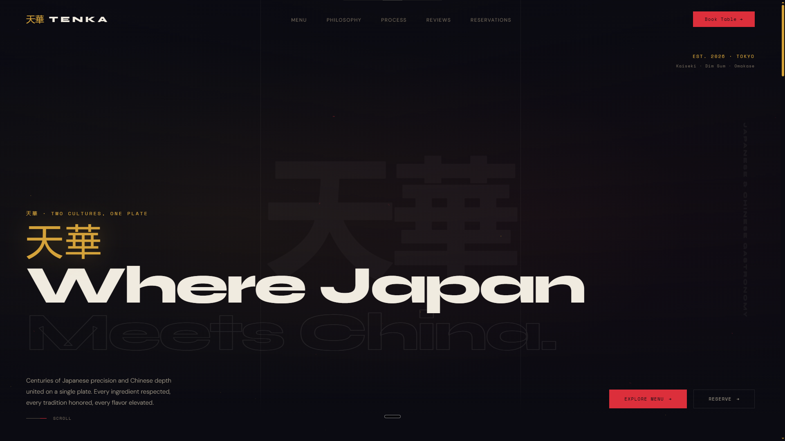
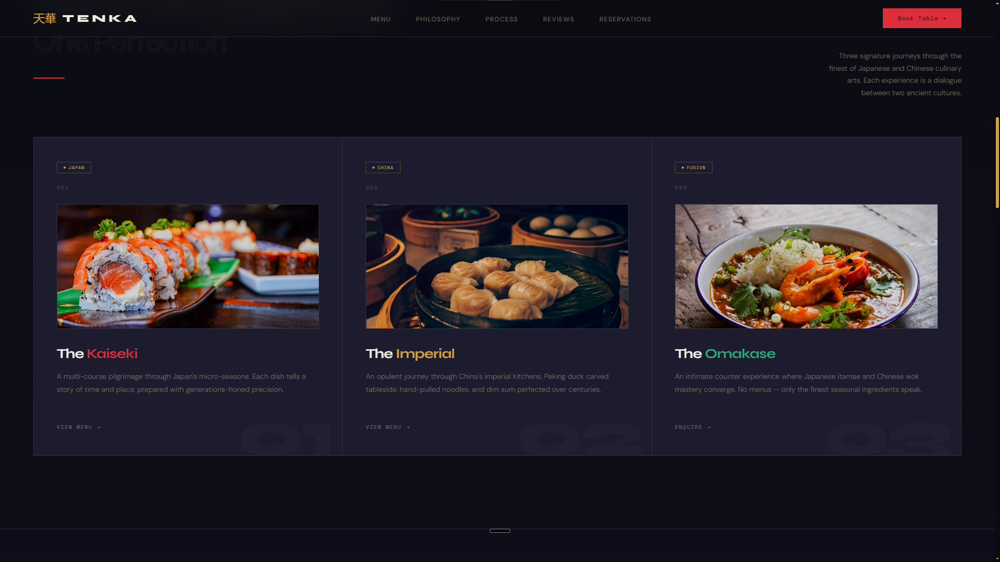
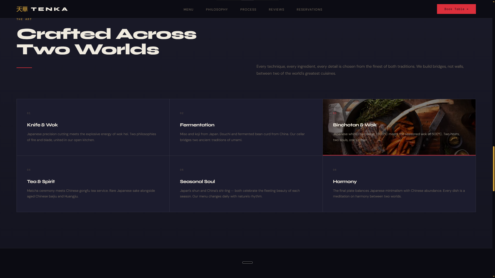
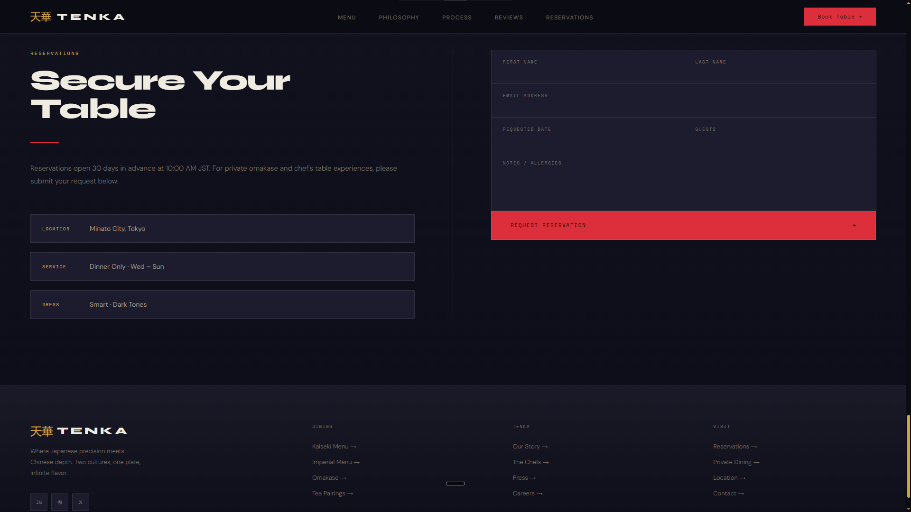

# 天華 Tenka — Japanese & Chinese Gastronomy

A landing page concept for a Tokyo fine-dining restaurant where Japanese precision meets Chinese depth.

🔗 **Live:** https://tenka-japanese-chinese-gastronomy.akshaycodecrafter.workers.dev/

## Preview









## About

Tenka is a concept I designed around a simple idea: most "fusion" restaurant sites either lean too hard into one culture or flatten both into something generic. I wanted a site that felt like it respected two distinct culinary traditions — Japanese kaiseki precision and Chinese imperial depth — without blending them into mush. The result is a dark, editorial-style landing page built around three signature dining experiences instead of a typical menu list.

## What's on the page

- **Hero** — the "Where Japan Meets China" statement with a scroll-triggered intro
- **Menu / Experiences** — three signature journeys: The Kaiseki, The Imperial, The Omakase
- **Philosophy / Process** — a six-part breakdown of technique (knife & wok, fermentation, binchotan, tea, seasonality, harmony)
- **Reviews** — guest testimonials section
- **Reservations** — a request-a-table form (front-end only, no backend wired up)

## Built with


- Vanilla HTML/CSS/JS — no frameworks, no build step
- Scroll-based reveal animations and a count-up effect on stats
- Fully responsive, mobile menu included

## Why I built it this way

I kept this as plain HTML/CSS/JS on purpose instead of reaching for a framework — for a single landing page, a build step just adds friction without adding value. The trade-off is everything lives in one place (no component reuse), but for a project this size that's the right call: it's easy for anyone to clone, open, and understand in five minutes without installing anything.

## Running it locally

```
Tenka-Japanese-Chinese-Gastronomy/
├── index.html
├── css/
│ └── style.css
├── js/
│ └── script.js
└── assets/
```

Just clone the repo and open `index.html` in a browser — no build step, no dependencies.

## Status

Demo/concept build. Contact details, reviews, and reservation flow are illustrative only.
